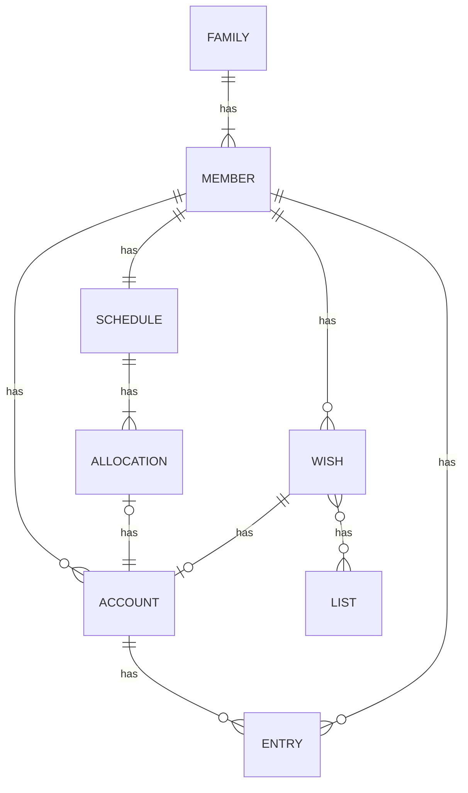

# mymoney

A way to track money for kids without an actual account

- Lists can be shared via secure link (no need for viewer to sign up for account)
- Wishlist feature can be standalone
- Wishlist looks like a store? link to actual sites, but don't have to
- schedule can be flat dollar value, or percentage (to teach about insurance)
